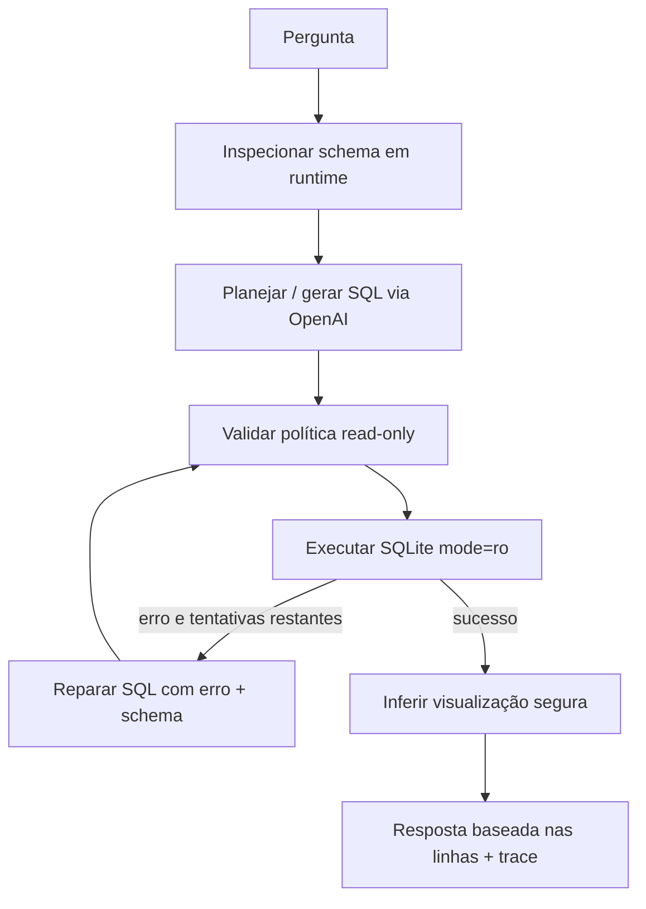

# Data Navigator — Assistente Virtual de Dados

Uma aplicação Streamlit em Python que responde perguntas de negócio sobre um SQLite usando um agente OpenAI. O sistema descobre o schema do banco em tempo de execução, planeja SQL, executa-o em acesso somente leitura e entrega resultado e trace auditável.

## Funcionalidades

- Introspecção real de tabelas, colunas, chaves estrangeiras e pequenas amostras (`sqlite_master`, `PRAGMA table_info` e `foreign_key_list`);
- Geração de até três consultas SQLite por pergunta, incluindo JOIN, agregação e datas ISO;
- Reparação automática de SQL inválido, com erro do SQLite e schema como contexto, limitada por `MAX_SQL_RETRIES`;
- Resolução temporal data-driven: mês sem ano usa a ocorrência mais recente daquele mês na fonte relevante; períodos recentes são ancorados na maior data disponível, nunca no relógio do servidor;
- Validação semântica após a execução para detectar resultado vazio com filtros temporais contraditórios e solicitar reformulação limitada;
- Proteção em duas camadas: URI `mode=ro` no SQLite e allow-list de `SELECT`/CTE, uma instrução apenas;
- Tabela, KPI, barra ou linha escolhidos somente a partir das colunas retornadas;
- Trace com plano observável, SQL, erros, tentativas, tabelas e duração. Não exibe raciocínio privado do modelo.

O trace diferencia `schema disponível`, `tabelas efetivamente consultadas`, interpretação temporal, queries de profiling e queries finais. Assim, a auditoria mostra somente as tabelas que aparecem nas SQLs executadas, não todas as tabelas do banco.

## Arquitetura



O orquestrador em `DataAgent` mantém estado explícito (`ExecutionTrace`) e responsabilidades separadas; o desenho é diretamente portável para `StateGraph`/LangGraph e a dependência já está declarada para evoluir o fluxo visualmente. Mantive a execução síncrona e pequena para a demonstração não depender de um runtime adicional.

O modelo recebe um resumo limitado do schema, não o banco inteiro. Ele retorna JSON de plano/SQL; a aplicação valida a consulta antes de executá-la. A resposta numérica vem sempre das linhas devolvidas pelo SQLite — o modelo não recebe permissão para produzir métricas finais.

Antes de planejar consultas com expressões temporais, a aplicação executa pequenas queries de profiling (`MIN`, `MAX` e `MAX` filtrado pelo mês) nas colunas de data descobertas em runtime. Isso torna explícita, por exemplo, a interpretação de “maio” como maio do ano mais recente que contém dados. Se uma consulta válida retorna vazio com indício de conflito temporal, o agente registra a investigação, pede uma reformulação ao modelo e limita as tentativas. Ausência legítima de dados não dispara retry.

### System prompt do planejador SQL

O system prompt abaixo está centralizado em `data_assistant/llm.py`. Para cada pergunta, a aplicação adiciona no input o schema real (incluindo chaves, valores categóricos e pequenas amostras), a resolução temporal calculada no banco e a pergunta do usuário.

```text
Você é um planejador SQL SQLite. Retorne APENAS JSON
{"summary":str,"sql":[str],"tables":[str]}.

Use exclusivamente SELECT/CTEs, no máximo 3 SQLs. Não invente tabela/coluna.
Datas ISO usam strftime. Para “último ano”, descubra a data máxima nos dados
quando necessário. Use a RESOLUÇÃO TEMPORAL fornecida; não combine MAX global
com um filtro de mês incompatível.

Em rankings com ORDER BY e LIMIT, inclua desempate determinístico pela dimensão
exibida (por exemplo, estado ASC). Use os valores categóricos reais fornecidos
no schema para filtros semânticos; um termo de categoria na pergunta deve filtrar
o valor correspondente, e não uma categoria mais ampla.

Para janelas temporais, use exatamente a janela da fonte relevante indicada na
resolução (não uma subtração de dias/anos que inclua mês parcial extra).
```

## Estrutura

```text
app.py                    interface Streamlit
data_assistant/
  config.py               ambiente e caminhos
  database.py             conexão read-only e execução
  schema.py               introspecção dinâmica
  security.py             política SQL
  llm.py                  cliente OpenAI centralizado
  agent.py                fluxo, retry, trace e visualização
  models.py               contratos tipados
tests/test_assistant.py   testes unitários/integrados locais
```

## Configuração e execução

Requer Python 3.10+ e uma chave OpenAI. O banco padrão já é `anexo_desafio_1.db`; altere `DATABASE_PATH` para usar outro arquivo.

```bash
python3 -m venv .venv
source .venv/bin/activate
pip install -r requirements.txt
cp .env.example .env
# preencha OPENAI_API_KEY no .env
streamlit run app.py
```

Também há `make install`, `make run`, `make test` e `make lint`. Sem chave, a interface informa a configuração faltante e não simula resultados.

## Consultas validadas no banco fornecido

As consultas abaixo foram executadas diretamente contra `anexo_desafio_1.db`. São evidências de validação, não regras hardcoded da aplicação.

| Pergunta | Estratégia | Resultado validado |
|---|---|---|
| 5 estados com mais clientes que compraram por app em maio | `clientes` + `compras`, `COUNT(DISTINCT)`, mês | São Paulo 6; Minas Gerais 3; Santa Catarina 3; Alagoas 2; Espírito Santo 2 |
| Clientes que interagiram por WhatsApp em 2024 | `campanhas_marketing`, filtro de ano e `DISTINCT` | 17 |
| Categorias com mais compras em média por cliente | `compras`, `COUNT / COUNT DISTINCT` | Roupas 2,21; Viagens 2,16; Livros 1,98 |
| Reclamações não resolvidas por canal | `suporte`, filtro `Reclamação`/`resolvido=0` | Telefone 19; Chat 18; E-mail 14 |
| Tendência de reclamações por canal no último ano disponível | máximo `data_contato`, janela de 12 meses, `strftime` | ago/2024–jul/2025; resultado mensal por canal |

Mais cenários verificados: receita por estado (JOIN/ranking: São Paulo R$141.665,16), ticket médio por categoria (agregação: Alimentos R$802,30) e tendência mensal de compras (`strftime('%Y-%m', data_compra)`).

## Testes

`tests/test_assistant.py` cobre introspecção, SELECT e conexão read-only, bloqueio de comandos destrutivos/múltiplas instruções, erro SQLite, retry limitado, `VisualizationSpec`, JOIN, agregação e período mensal. Os testes usam `FakePlanner`; portanto não fazem chamadas pagas à OpenAI.

## Limitações e melhorias

- A qualidade semântica do SQL depende do modelo configurado; em produção, adicionaria avaliação com conjunto de perguntas e logging estruturado.
- Hoje o resultado final é apresentado fielmente em tabela/KPI, com texto propositalmente conservador; uma etapa opcional de narrativa pode receber exclusivamente as linhas retornadas.
- Pode-se materializar o fluxo atual em um `StateGraph` LangGraph para checkpoints, streaming e telemetria de cada nó.
